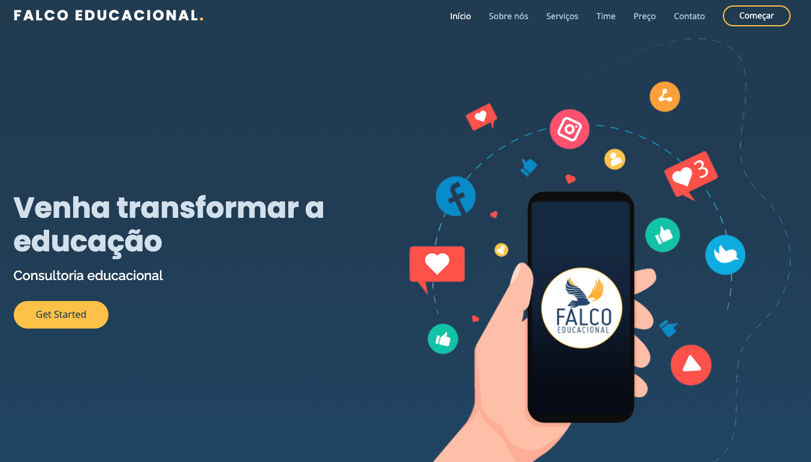

# Falco Educacional

    

## Overview
The main purpose of this project is to create a webpage to a cliente about educational services.

## Libraries 

- EJS => Render HTML;
- Express => Flexible framework;
- Nodemon => Update server when save

## Running the application

- Run: `npm install`;
- Run: `nodemon index.js`;
- On web browser: http://localhost:3000/

## Licenses
 

    

